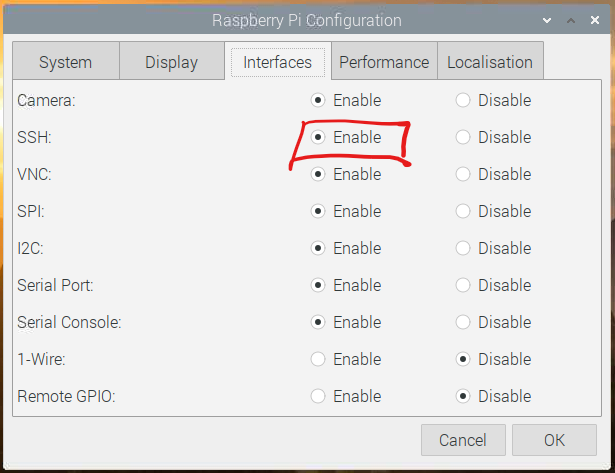

# Pre-Requisites! #

## Step 1 - Enable SSH ##

- Open the Raspberry Pi Configuration Utility and enable the SSH option.

    

- Hit Ok and accept the prompts to restart the Raspberry Pi

| Previous | Next |
| -------- | ---- |
| [< Introduction](README.md) | [Step 2 - Create a Samba Share >](02-create-samba-share.md) |