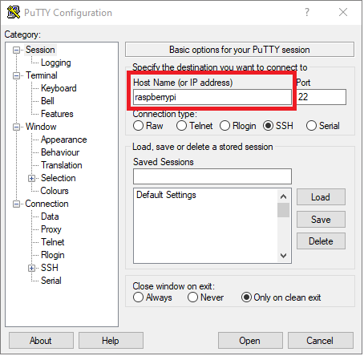

# Pre-Requisites! #

## Step 2 - Create Samba Share ##

- Connect to the Raspberry Pi using SSH (PUTtY for instance).
- You can get a copy of PUTtY here;

    https://www.chiark.greenend.org.uk/~sgtatham/putty/latest.html

- Start PUTtY and enter "raspberrypi" in the "Host Name (or IP address)" text box;

<p align="center">
    
</p>

- Press the `Open` button at the bottom of the window.
- Accept any warnings which may appear.
- Enter a user name or `pi` and press the enter key
- Enter a password of `raspberry` and press the enter key. The password won't be displayed on screen for security reasons.

- You will now be logged in to your Pi.

- Install Samba;

    ```
    sudo apt-get install samba samba-common-bin
    ```

- Make a shared directory

    ```
    sudo mkdir -m 1777 /home/pi/share
    ```

- Edit the Samba Setup File

    ```
    sudo nano /etc/samba/smb.conf
    ```

- Add the following to the very bottom of the file;

    ```    
    [share]
    Comment = Pi shared folder
    Path = /home/pi/share
    Browseable = yes
    Writeable = Yes
    only guest = no
    create mask = 0777
    directory mask = 0777
    Public = yes
    Guest ok = yes
    ```

- Save the file by pressing `ctrl` and the `x` key, then press the `y` key to confirm and press the `enter` key to save and exit.

- Create a Samba Password with;

    ```
    sudo smbpasswd -a pi
    ```

- You can use the same password as logging in to your pi for now. You'll need to enter the password twice to confirm. As with logging in to the Pi, the password won't be displayed on screen for security reasons.

- Restart the Pi;

    ```
    sudo reboot
    ```
- Reconnect to the Raspberry Pi using SSH (PUTtY for instance).
- Browse to the new `share` directory on the Pi at `\\<Raspberry Pi Hostname>\share`

| Previous | Next |
| -------- | ---- |
| [< Step 1 - Enable SSH](01-enable-ssh.md) | [Step 3 - Install .NET 5 >](03-install-dot-net-5.md) |
