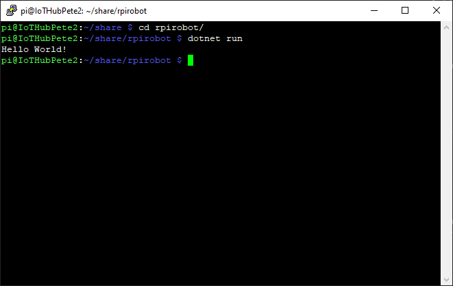

# Create Raspberry Pi Robot Project #

- Enter the Share Directory;

    ```
    cd /home/pi/share
    ```

- Create Pi Robot Project;

    ```
    dotnet new console -o rpirobot
    ```

- Enter the Pi Robot directory;

    ```
    cd rpirobot
    ```

- Test the project runs

    ```
    dotnet run
    ```

<p align="center">
    
</p>

| Previous | Next |
| -------- | ---- |
| [< Step 3 - Install .NET 5](/03-install-dot-net-5.md) | [Step 5 - Flash LEDs >](05-flash-leds.md) |