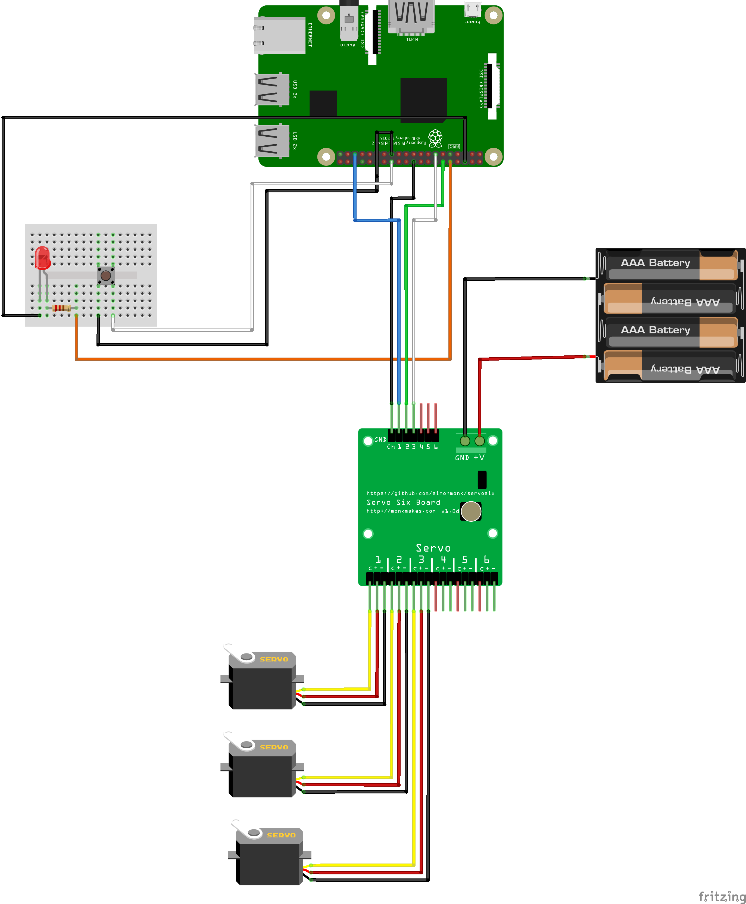

# Build the Circuit #

- We will be building the following circuit;

    

- The Raspberry Pi GPIO or General Purpose Input Output Pins are as follows;

    

- First connect the 220ohm resistor, LED and Button as follows;

    

| Previous | Next |
| -------- | ---- |
| [< Step 4 - Create Pi Robot Project](/04-create-pi-robot-project.md) | [Step 6 - Flash LEDs >](06-flash-leds.md) |