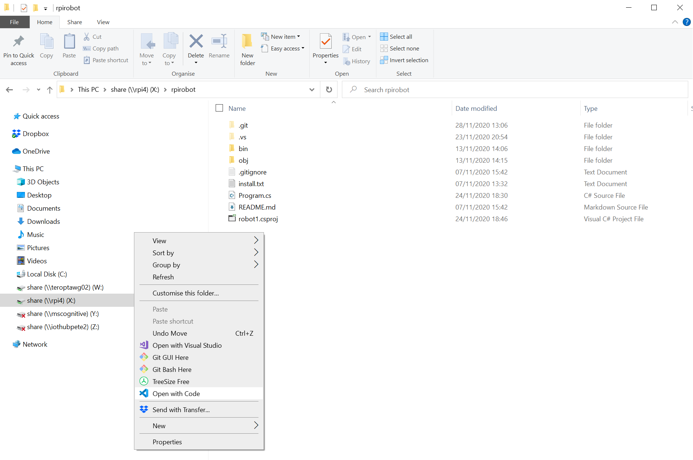
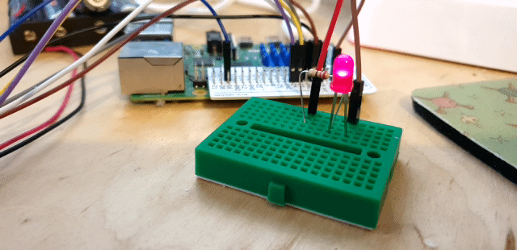

# Flash LEDs #

- Make sure you're in the robot_firmware Project directory
- Install the `System.Device.Gpio` Nuget Package

    ```
    dotnet add package System.Device.Gpio
    ```

- Back on your machine, open the new robot_firmware project in code.
- For Windows;
    - Navigate to the robot_firmware folder via `\\<Pi Host Name>\share\robot_firmware`
    - Open the folder by right clicking in the empty space near the files and click "Open with Code"

    <p align="center">
        
    </p>

- Add the following using statements to the top of the program.cs file to allow access to GPIO and Timers;

    ```cs
    using System.Device.Gpio;
    using System.Threading;
    ```

- Add the following section of code to the Main sub after the `Console.WriteLine("Hello World")` Line;

    ```cs
    GpioController controller = new GpioController(PinNumberingScheme.Board);

    var pin = 10;
    var lightTime = 300;

    controller.OpenPin(pin, PinMode.Output);

    try
    {
        while(true)
        {
            controller.Write(pin, PinValue.High);
            Thread.Sleep(lightTime);
            controller.Write(pin, PinValue.Low);
            Thread.Sleep(lightTime);
        }
    }
    finally
    {
        controller.ClosePin(pin);
    }
    ```

- This section of code;
    - Creates a new GPIO Controller Object using the `Board` Pin Numbering Scheme.
    - Defines a Pin Number variable and assigns pin 10 to it, this is where we've connected our LED.
    - Defines a value for a delay between turning the LED on and off of 300ms
    - Opens the LED Pin as an Output
    - Creates a loop.
    - In the loop;
        - The LED pin is set to a High Value, turning it on.
        - Then a delay for 300ms.
        - The LED pin is then set to a Low Value a Low Value, turning it off
        - Then a final delay for 300ms, before returning to the top of the loop
    - A finally section then closes the LED pin freeing any resources before the program exits.

- Save the file
- In an SSH Session, make sure you're in the `robot_firmware` directory
- Run the application with;

    ```
    dotnet run
    ```

- You should then see the LED flashing on and off

---

## Note:

If you receive the following error;

```
Unhandled exception. System.PlatformNotSupportedException
```

Then it's possible you're using something like a Pi 3A+ (thanks Eoin Ward). There’s currently an incompatibility with the Raspberry Pi 3A+ which has a different BCM Controller Chip.

This causes and error to be displayed when you try to control the Pi GPIO

You can work around this issue by replacing the following line;

```
GpioController controller = new GpioController(PinNumberingScheme.Board);
```

With;

```
var assembly = typeof(GpioDriver).Assembly;
var driverType = assembly.GetType("System.Device.Gpio.Drivers.RaspberryPi3LinuxDriver");
var ctor = driverType.GetConstructor(new Type[]{});
var driver = ctor.Invoke(null) as GpioDriver;

ctl = new GpioController(PinNumberingScheme.Board, driver);
```
---

<p align="center">
    
</p>

- Exit the program with ctrl+c

| Previous | Next |
| -------- | ---- |
| [< Step 5 - Build the Circuit](05-build-circuit-led-and-button.md) | [Step 7 - Read Button >](07-read-button.md) |