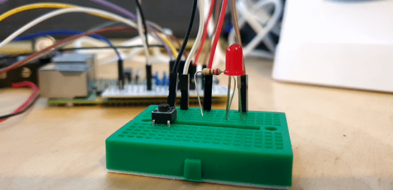

# Read a Button #

- Back in your project in VS Code
- Remove the existing code you have in the `static void main` sub and add in the following code after the `Console.WriteLine("Hello World")` Line;

    ```cs
    GpioController controller = new GpioController(PinNumberingScheme.Board);
    var pin = 10;
    var buttonPin = 26;
    
    controller.OpenPin(pin, PinMode.Output);
    controller.OpenPin(buttonPin, PinMode.InputPullUp);            

    try
    {
        while (true)
        {
            if (controller.Read(buttonPin) == false)
            {
                controller.Write(pin, PinValue.High);
            }
            else
            {
                controller.Write(pin, PinValue.Low);
            }
        }
    }
    finally
    {
        controller.ClosePin(pin);
    }
    ```

- This section of code;
    - Creates a new GPIO Controller Object using the `Board` Pin Numbering Scheme as in the previous example.
    - Defines a Pin Number variable and assigns pin 10 to it, this is where we've connected our LED.
    - Defines a Button Pin variable and assigns pin 26 to it, this is where we've connected our Button.
    - Opens the LED Pin as an Output
    - Opens the Button Pin as an Input
        - Note: This line also specifies that it's a `InputPullUp` pin. This means that, internally, the Raspberry Pi will pull this pin up to a high level. You can see that we've connected the other side to 0v or GND. So, when the button is not pressed it will be pulled up to a High Level. When the button is pressed it will then become low.
    - Creates a loop.
    - In the loop;
        - We read the button Pin using `controller.Read(buttonPin)... 
            - If the button is pressed, this line will return a false... So we turn the LED on.
            - If the button isn't pressed, this line will return a true... So we turn the LED off.
    - A finally section then closes the LED pin freeing any resources before the program exits.

- Save the file
- In an SSH Session, make sure you're in the `robot_firmware` directory
- Run the application with;

    ```
    dotnet run
    ```

- You should now be able to press the button and turn the LED on.

<p align="center">
    
</p>

- Exit the program with ctrl+c

| Previous | Next |
| -------- | ---- |
| [< Step 6 - Flash LED](05-build-circuit-led-and-button.md) | [Step 8 - Build Circuit - Servos >](08-build-circuit-servos.md) |