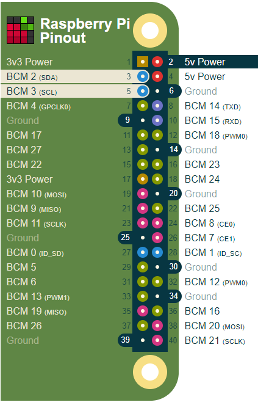
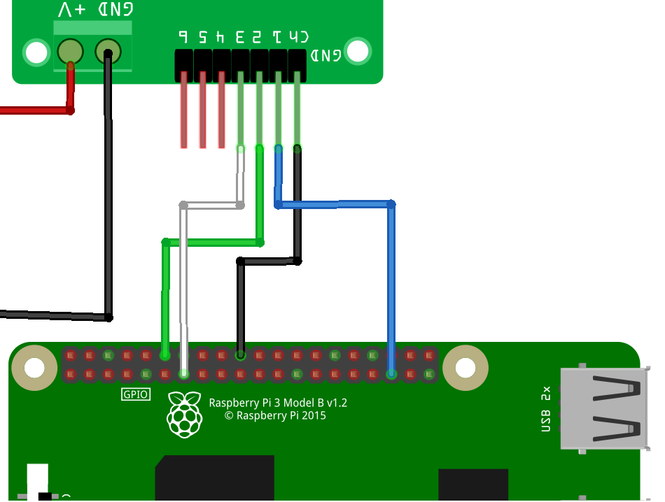

# Building the Circuit - 2 - Servos #

## Finished Circuit

- A reminder of the circuit we are building;

    

## Raspberry Pi GPIO

- A reminder of the Raspberry Pi GPIO;

    

## Connect the Monk Makes Servo Driver Board to the Pi

- Connect the Servo Driver board to the Pi as follows;

    

| Servo Driver Board Pin | Raspberry Pi Pin |
| - | - |
| GND | 20 |
| 1   | 35 |
| 2   | 12 |
| 3   | 13 |

- Connect the Servos to the Servo Driver Board as follows;

    

- Connect each Servo with it's orange or yellow wire connected to the C pin
- Connect the Battery Pack to the Servo Driver Board

| Previous | Next |
| -------- | ---- |
| [< Step 7 - Read Button ](07-read-button.md)| [Step 9 - Move Servos >](09-move-servos.md) |
