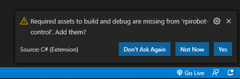
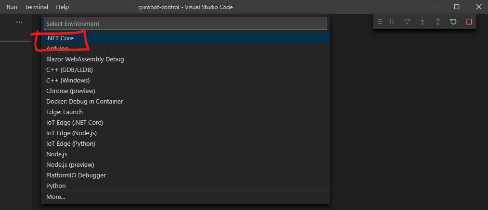
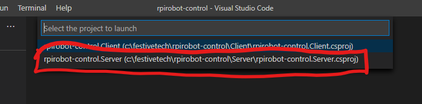
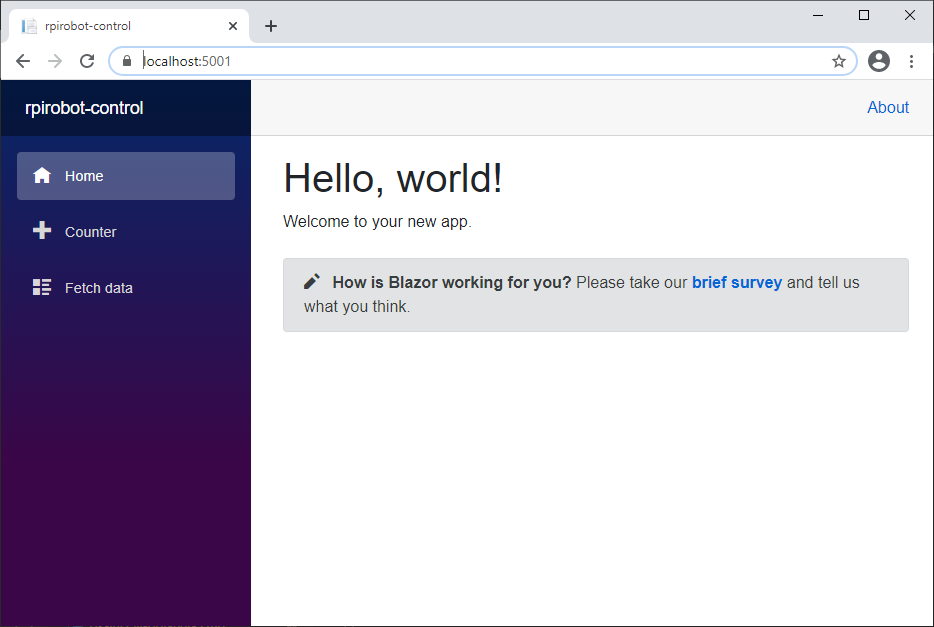
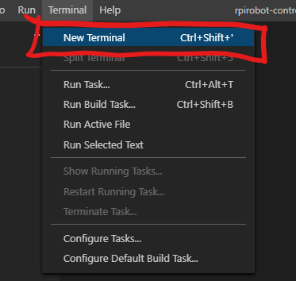

# Create the Blazor App #

- On your local machine, open and command prompt, navigate to your root directory and create a Hosted Blazor WASM app with;

    ```
    dotnet new blazorwasm --hosted -o rpirobot-control
    ```

- Enter the `rpirobot-control` directory.
- Add a the SignalR Client nuget package with;

    ```
    dotnet add Client package Microsoft.AspNetCore.SignalR.Client
    ```

- Add the excellent MatBlazor components with;

    ```
    dotnet add Client package MatBlazor
    ```

- Open the solution in VS code with

    ```
    code .
    ```

- You may see the following prompt generated by the C# Extension

<p align="center">
    
</p>

- Click the "Yes" button to add the ability to run and debug directly from VS Code.
- We can now make sure that our new Blazor App works by either pressing the F5 key and selecting .NET Core;

<p align="center">
    
</p>

- We'll be prompted which project to run, select the Server Project;

<p align="center">
    
</p>

- You will most likely need to hit F5 again to actually run the app.
- You should soon see the vanilla Blazor WASM app;

<p align="center">
    
</p>

- If, for some reason you can't debug this way. You can run the app manually by opening a new terminal from the Terminal Menu;

<p align="center">
    
</p>

- Use the following to start the app;

    ```
    dotnet run --project Server/rpirobot-control.Server.csproj
    ```

- You can then open a browser window and navigate to;

    https://localhost:5001

- Stop the app from running by closing the browser window.
- If you launched the app manually, then you'll also need to use `ctrl+c` in the terminal window.

| Previous | Next |
| -------- | ---- |
| [< Step 10 - Add SignalR](10-add-signalr.md) | [Step 12 - Add Blazor Controls >](12-add-blazor-controls.md) |