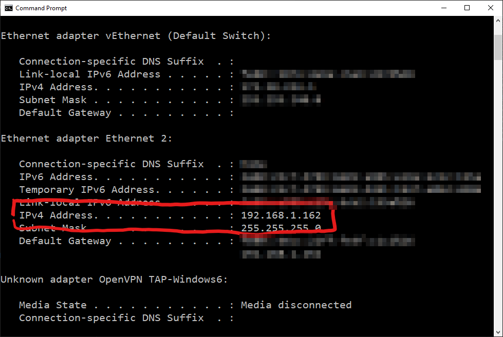
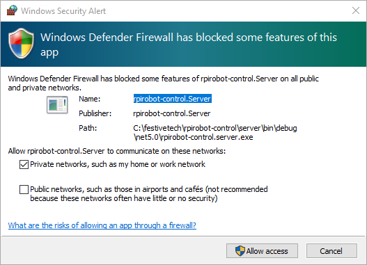

# Configure and Run #

We now have the building blocks in place to make our robot arm move! (Can we get a Yipee!).

The first thing we need to do is get the IP Address of our machine.

- Ooen a command prompt and get your machine IP Address with;

    ```
    ipconfig
    ```

- Make a note of the IP Address, for example `192.168.1.162`;

<p align="center">
    
</p>

- Open the robot_firmware project on the Raspberry Pi.
- Replace the `<PC IP Address>` section in the `Program.cs` file with the PC Ip Address. For instance;

    ```cs
    connection = new HubConnectionBuilder()
                    .WithUrl("https://192.168.1.162:5001/chathub",conf =>
                    {
                        conf.HttpMessageHandlerFactory = (x) => new HttpClientHandler
                        {
                            ServerCertificateCustomValidationCallback = HttpClientHandler.DangerousAcceptAnyServerCertificateValidator,
                        };                    
                    })
                    .Build();
    ```

We can now see if it all works...

- Return to the Blazor App, and start it up.
- You may need to allow the SignalR Service through your firewall;

<p align="center">
    
</p>


| Previous | Next |
| -------- | ---- |
| [< Step 13 - Add Control Code](13-add-control-code.md) | | [Return to the Start >](README.md) |
